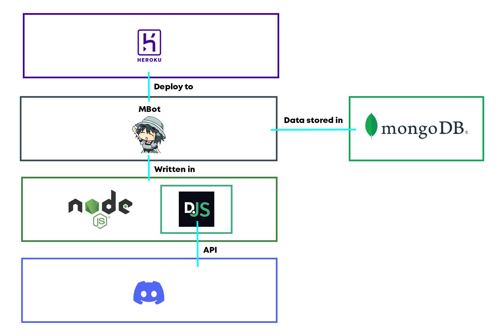

# MBot

## Table of Contents
1. [Overview](#overview)
2. [Inspiration](#inspiration)
3. [How it's made](#how-its-made)
4. [Challenges](#challenges)
5. [Set-up](#set-up)
6. [Commands](#commands)
7. [Future](#future)

## Overview
**MBot** is a multi-purpose discord bot with administrative commands, mini-games, currency system, xp system, and meme generator that was created for entertainment purposes.

## Inspiration
As someone who uses Discord frequently, I wanted to create a bot that automated my tasks and could be used for entertainment purposes. 

## How it's made
As this was just a bot within Discord, it was mostly backend work. After initially setting up the bot to accept commands using Discord.js (Node.js module) , I was ready to start 
implementing features. I developed the features through an iterative process, where I would first brainstorm what the feature required (database, libraries, etc.), then implementing and coding
the feature (lots of googling), and then finally testing the feature thoroughly to make sure it worked properly and didn't have any bugs. 
After about 3 months of adding features, I deemed it to be sufficient to publish online so that other people could use it. Heroku was the perfect fit for all my needs and has 
been hosting MBot to this day.

## Challenges
Figuring out the best way to implement features was the biggest challenge, especially the ones that required a database since I had no prior knowledge 
of using databases. However, after many hours of research, talking to people on coding forums, and trial and error, I eventually learned how to update and retrieve user data 
from the database. This knowledge helped me implement a ton of features, such as the xp and currency system, as well as user profiles.

## Set-up
1. Create a Discord account 
2. Create a server
3. Click **[here](https://discord.com/api/oauth2/authorize?client_id=722306796483641366&permissions=8&scope=bot)** to invite MBot to your server 
4. Check out the [commands](#commands) below and have fun!

## Commands
All commands that can be performed by MBot. Prefix is $. Simply type the command in the message box and press enter.

| Game Commands | Description |
| ----------- | ----------- |
| `$rps`      | Play rock-paper-scissors       |
| `$flip`   | Play heads-or-tails        |
| `$trivia`      | Answer trivia questions       |
| `$math`   | Answer math questions       |

| Meme Commands | Description |
| ----------- | ----------- |
| `$meme`      | Sends random dank meme   |
| `$cute`      | Sends random cute meme  |

| Administrative Commands | Description |
| ----------- | ----------- |
| `$kick @<username> <reason>`      | Kicks a user from the server and records the reason   |
| `$ban @<username> <reason>`      | Bans a user from the server and records the reason   |
| `$clear <amount of messages>`      | Deletes the specified number of messages in a channel   |

| Coin Commands | Description |
| ----------- | ----------- |
| `$coins`      | Shows number of MCoins you have    |
| `$coins @<username>`      | Shows number of MCoins a user has   |
| `$pay @<username> <amount of MCoins>`   | Transfers specified amount of MCoins to specified user     |
| (Admin)`$generate <amount of MCoins>`      | Add a certain number of coins to your account       |
| `$reset`   | Sets users MCoin balance to 0      |

| Miscellaneous Commands | Description |
| ----------- | ----------- |
| `$userinfo`      | Shows your stats |
| `$userinfo @<username>`      | Shows stats of specified user  |
| `$hello`      | MBot greets you |
| `$tuturu`      | Tuturu! |
| `$report @<username> <reason>`  | Reports a user with a reason |
| `$lvl`      | Shows your level card |
| `$lvl @<username>`      | Shows level card for specified user |
| `$rating <attachment>`      | Adds 👍 and 👎 reactions to attachment |
| `$remind <message>`      | Reminds the user of the specified message after a specified period of time |
| `$prizes`      | List of prizes you can redeem with MCoins |
| `$redeem <prize>`      | Redeem a prize with MCoins |

## Future
I don't have any current plans to implement more features but maybe I'll be inspired in the future.

## Thanks for stopping by!

